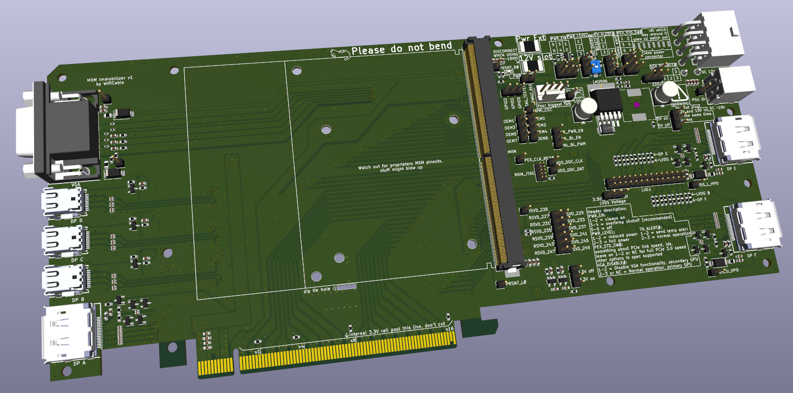
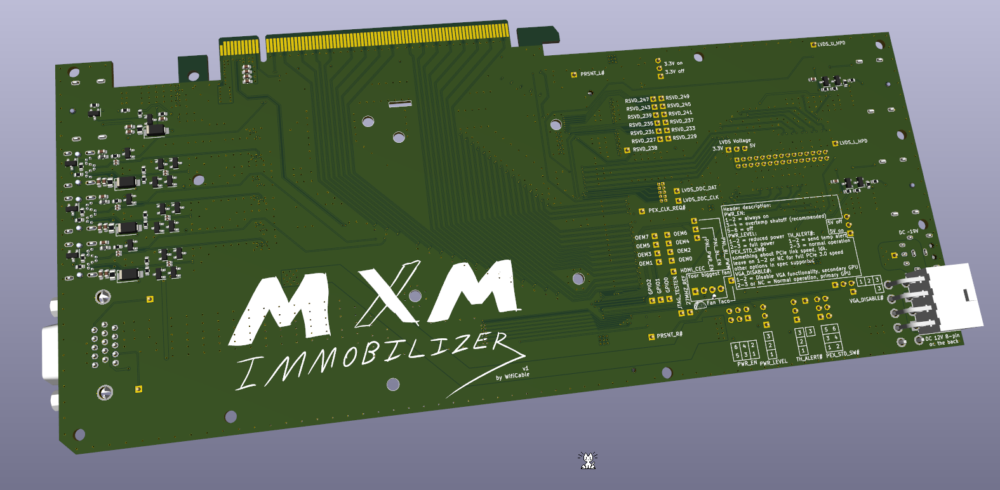
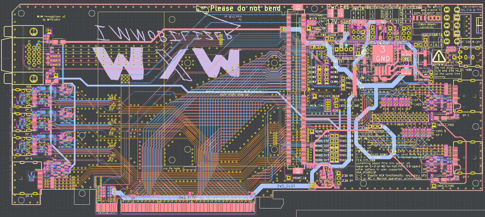

# MXM Immobilizer

It's an MXM to PCIe adapter! All the ones on aliexpress and stuff are overpriced and incomplete smh 😔  
Also this one's open source lol.

It's not quite done yet, a lot of stuff is currently suboptimal, but it might actually work in its current state. No guarantees though.

If you've got any complaints about how it has been designed so far, please keep in mind this was my 3rd PCB project ever and I'm just doing this for fun. Of course I would love to see it real and working some day though, so feedback is very welcome. I want to make it as good as it can possibly be!

# Features:
**Exposes everything MXM has to offer**

* 6 Displayport outputs
* DP++ support for passive HDMI dongles
* VGA output
* Dual channel LVDS output
* Full PCIe x16 link
* Up to 190W of power
* Clevo extra MXM power cable support
* OEM pins
* Reserved pins
* Power control pins
* JTAG header
* Fan header with PWM

In accordance with the MXM 3.1 specification, the LVDS pins can optionally be mapped to be 2 more DP outputs instead, DP E and DP F. The board has 0Ω jumpers to route those lanes to either the LVDS header or the 2 internal DP outputs.

The LVDS header has been designed to probably match the common pinout found on cheap LCD driver boards, but I have not really verified this.

The headers are meant to expose every configuration and feedback pin MXM has to offer:
* Power enable
* Power level/throttling
* Overtemperature throttling
* Temperature warning output
* PCIe link speed
* Primary/secondary GPU toggle

They can be set with jumpers or connected to whatever external equipment you want.

The board is prepared for multiple different power input options:
* PCIe slot 12V only
* PCIe slot 12V + 8-pin 12V
* 8-pin 12V only
* 19V laptop power supply input only

The 19V laptop power supply input is meant to support high-power cards, since the MXM spec allows up to 20V and 10A, a higher voltage than 12V is needed for cards that can pull over 120W.  
In this case the 12V supply has to be disconnected though, or you'll end up frying something real good.

## Todo:
* Re-route PCIe and DP so the 3.3V rail isn't pushed down so far
* Fix the AUX diffpair abuse
* Make all the headers be not totally awful
* Add jumper storage header
* Add default position 0R resistors for headers
* Diffpair wiggles
* DP diffpair between-lane length matching
* Remove ground plane around PCIe traces
* Change mxm mount screw holes to be plated so you can solder on screw posts

## Reference sources:

The HP EliteBook 8540W schematic was a big help with implementing the DP connections, especially DP++  
Other laptop schematics with MXM were also referenced, as well as the MXM specification of course.